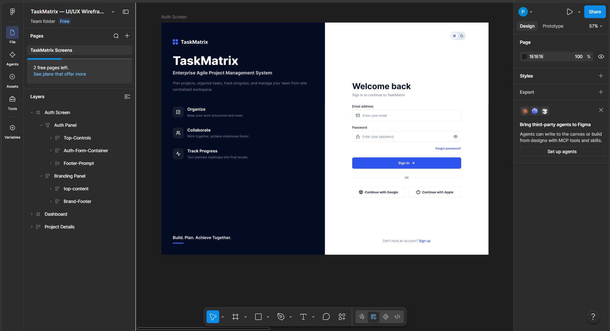
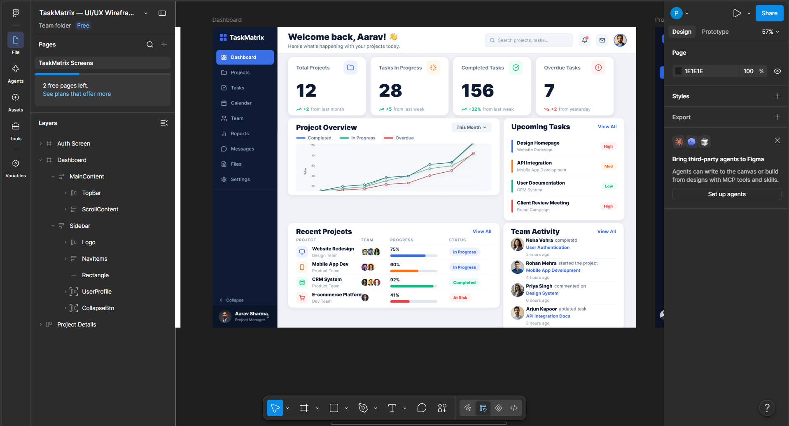
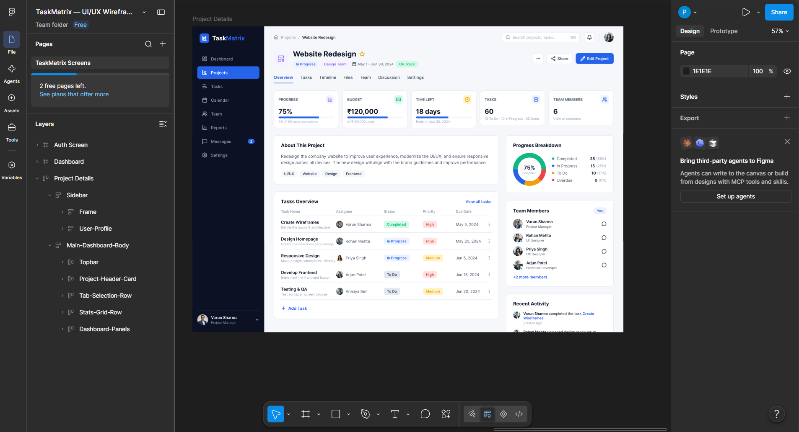

# TaskMatrix

## Enterprise Agile Project Management System

TaskMatrix is a commercial-grade Agile project management application designed to help development teams plan projects, organize tasks, track progress, manage team members, and monitor project activity from a centralized dashboard.

The project is being developed as a 4-week Prodesk Capstone project.

---

## Project Information

| Item | Details |
|---|---|
| Project Name | TaskMatrix |
| Project Type | Enterprise Agile Project Management System |
| Designated Track | Frontend Specialist |
| Repository | `prodesk-capstone-TaskMatrix` |
| Development Duration | 4 Weeks |

---

## Problem Statement

Development teams often rely on multiple disconnected tools to manage projects, tasks, team members, deadlines, and progress.

TaskMatrix aims to provide a centralized workspace where teams can manage their Agile workflow through projects, tasks, dashboards, filters, and team collaboration features.

---

## Target Users

### Project Managers

- Create and manage projects
- Monitor project progress
- Assign tasks to team members
- Track deadlines
- Monitor team workload

### Developers

- View assigned tasks
- Update task status
- Manage priorities
- Track workload
- Monitor project progress

### Team Members

- View project activity
- Collaborate through task information
- Monitor assigned work
- Track deadlines and priorities

---

# Core Features

Features are prioritized according to the capstone requirements.

## P0 — Mandatory MVP

### Authentication

- User registration
- User login
- Logout
- Protected application routes
- Authentication state management

### Dashboard

- Project overview
- Task statistics
- Progress indicators
- Recent activity
- Project and task summaries

### Project Management

- Create projects
- View projects
- View project details
- Edit projects
- Delete projects
- Project status management

### Task Management

- Create tasks
- View tasks
- Edit tasks
- Delete tasks
- Assign tasks
- Task status management
- Task priority management
- Task due dates

### Global State Management

Redux Toolkit will manage application-wide state including:

- Authentication state
- Project state
- Task state
- Filter state
- Team state
- UI/theme state

---

## P1 — Priority Features

### Task Filtering

Users will be able to filter tasks by:

- Status
- Priority
- Assignee
- Project
- Due date

### Search

- Search projects
- Search tasks
- Search team members

### Team Management

- View team members
- Assign members to projects
- View member workload

### Project Details

- Project information
- Project task list
- Project progress
- Assigned team members
- Project activity

### Responsive Interface

The application will support:

- Desktop
- Tablet
- Mobile

---

## P2 — Advanced Features

### Agile Board

A Kanban-style board containing:

- Backlog
- To Do
- In Progress
- Review
- Done

### Drag and Drop

Tasks can be moved between workflow columns.

### Notifications

Users can receive notifications for:

- Task assignments
- Status changes
- Approaching deadlines
- Project updates

### Analytics

Project managers can view:

- Task completion rate
- Project progress
- Team workload
- Completed vs pending tasks
- Task distribution

### Dark / Light Theme

A global theme manager will provide:

- Light mode
- Dark mode
- Persistent theme preference

---

# Technology Stack

## Frontend

- Next.js
- React
- JavaScript
- HTML5
- CSS3

## State Management

- Redux Toolkit
- React Redux

## Testing

- Jest
- React Testing Library
- Testing Library User Event

## Component Development

- Storybook

## Backend

Planned backend integration:

- Node.js
- Express.js

## Database

Planned database:

- MongoDB
- Mongoose

## Authentication

Planned authentication architecture:

- JWT
- Secure password hashing

## Development Tools

- Visual Studio Code
- Git
- GitHub
- Figma
- Draw.io

---

# UI/UX Design

The interface follows a modern enterprise SaaS dashboard design focused on clarity, consistency, accessibility, and responsive usability.

The Sprint 13 Figma design contains the following core viewports:

1. Authentication Screen
2. Main Dashboard
3. Project Details

### Core UI/UX Screens

#### Authentication Screen

Provides:

- Login interface
- Email and password fields
- Authentication actions
- Account access options

#### Main Dashboard

Provides:

- Project overview
- Task statistics
- Progress visualization
- Recent projects
- Recent tasks
- Team activity

#### Project Details

Provides:

- Project information
- Project status
- Priority
- Project progress
- Task list
- Team members
- Project activity

### Figma Design

[TaskMatrix — UI/UX Wireframes](https://www.figma.com/design/Rp4KbF38fmzQkKwoGuG0jk/TaskMatrix-%E2%80%94-UI-UX-Wireframes)

---

### UI Preview

#### Authentication



#### Dashboard



#### Project Details




# Application Architecture

## Frontend Architecture

```text
                         TaskMatrix
                              |
                       Next.js / React
                              |
              +---------------+---------------+
              |                               |
        UI Components                    Redux Toolkit
              |                               |
      +-------+-------+             +---------+---------+
      |       |       |             |         |         |
     Auth  Dashboard Projects      Auth     Projects  Tasks
              |                       State    State    State
              |
         API Service Layer
              |
        Mock REST API
              |
      +-------+-------+
      |       |       |
   Projects  Tasks   Users